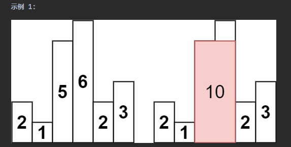
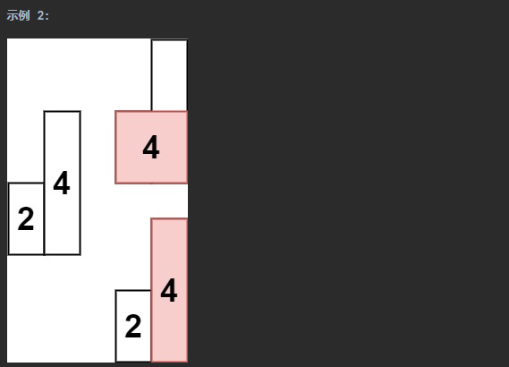

## 数组相关问题

循环不变量：是一组在循环体内、每次迭代均保持为真的性质（表达式）。
在编写代码时，定义清晰明确的循环不变量，然后在迭代的过程中维持循环不变量始终为真，能够比较好地保证程序的正确性，确保不会重复判断或者漏判某个元素。

关于数组有以下一些技巧：
1. 有序数组考虑使用二分查找
2. 对撞指针
3. 快慢指针（双指针）
4. 滑动窗口（一般需要在窗口内做记录，比如求和、去重之类）

###### 二分查找

给定一个长度为n的数组nums，元素按从小到大的顺序排列且不重复。请查找并返回元素target在该数组中的索引。若数组不包含该元素，则返回-1。
```java
public int search(int[] nums, int target);
```

二分查找（binary search）是一种基于分治策略的高效搜索算法。它利用数据的有序性，每轮缩小一半搜索范围，直至找到目标元素或搜索区间为空为止。
代码：
```java
public int search(int[] nums, int target) {
    int l = 0, r = nums.length - 1;  // 定义搜索区间[l...r]，左闭右闭(定义左闭右闭的循环不变量，确保不会漏掉某个元素)
    while (l <= r) {  // 只要[l...r]区间还有元素，都要继续查找
        int mid = l + (r - l) / 2; // 取中间值用这种写法，能避免integer溢出
        if (nums[mid] == target) {
            return mid;
        } else if (nums[mid] > target) {
            r = mid - 1; // l和r修改后，也要维持左闭右闭，避免漏掉元素或重复判断元素
        } else {
            l = mid + 1; // l和r修改后，也要维持左闭右闭，避免漏掉元素或重复判断元素
        }
    }
    return -1;
}
```

###### 问题283：移动零

给定一个数组nums，编写一个函数将所有0移动到数组的末尾，同时保持非零元素的相对顺序。请注意，必须在不复制数组的情况下原地对数组进行操作。
示例 1:
输入: nums = [0,1,0,3,12]
输出: [1,3,12,0,0]
```java
public void moveZeroes(int[] nums);
```

这题其实不难，将所有非零元素往前移，然后后面剩余的元素全部设置成零就可以了。
代码：
```java
public void moveZeroes(int[] nums) {
    int cursor = 0; // 数组元素逐个往后查找，查找到非零元素，就将非零元素往前移动
    int index = 0; // 非零元素移动的目标索引
    // 将index和cursor定义成slow、fast快慢指针会比较易懂一些
    while (cursor < nums.length) {
        if (nums[cursor] != 0) {
            if (index != cursor) {
                nums[index] = nums[cursor];
            }
            index++;
        }
        cursor++;
    }
    while (index < nums.length) {
        nums[index++] = 0;
    }
}
```

###### 问题27：移除元素

给你一个数组nums和一个值val，你需要原地移除所有数值等于val的元素。元素的顺序可能发生改变。然后返回nums中与val不同的元素的数量。
假设 nums 中不等于 val 的元素数量为 k，要通过此题，您需要执行以下操作：
更改 nums 数组，使 nums 的前 k 个元素包含不等于 val 的元素。nums 的其余元素和 nums 的大小并不重要。
返回 k。
```java
public int removeElement(int[] nums, int val);
```

这题和问题283一样，快慢指针就可以了。
代码：
```java
public int removeElement(int[] nums, int val) {
    int slow = 0, fast = 0;
    while (fast < nums.length) {
        if (nums[fast] != val) {
            if (slow != fast) {
                nums[slow] = nums[fast];
            }
            slow++;
        }
        fast++;
    }
    return slow;
}
```

###### 问题26：删除有序数组中的重复项

给你一个非严格递增排列的数组nums，请你原地删除重复出现的元素，使每个元素只出现一次，返回删除后数组的新长度。元素的相对顺序应该保持一致。然后返回nums中唯一元素的个数。
考虑 nums 的唯一元素的数量为 k ，你需要做以下事情确保你的题解可以被通过：
更改数组 nums ，使 nums 的前 k 个元素包含唯一元素，并按照它们最初在 nums 中出现的顺序排列。nums 的其余元素与 nums 的大小不重要。
返回 k 。
```java
public int removeDuplicates(int[] nums);
```

代码：
```java
public int removeDuplicates(int[] nums) {
    int slow = 0, fast = 1;
    while (fast < nums.length) { // 对于每一个元素nums[slow]，都找它的下一个不相同的元素
        while (fast < nums.length && nums[fast] == nums[slow]) {
            fast++;
        }
        if (fast < nums.length) {
            nums[++slow] = nums[fast++];
        }
    }
    return slow + 1;
}
```

###### 问题80：删除有序数组中的重复项II

给你一个有序数组nums，请你原地删除重复出现的元素，使得出现次数超过两次的元素只出现两次，返回删除后数组的新长度。
不要使用额外的数组空间，你必须在 原地 修改输入数组 并在使用 O(1) 额外空间的条件下完成。
```java
public int removeDuplicates(int[] nums);
```

代码：
```java
public int removeDuplicates(int[] nums) {
    int slow = 0, fast = 1;
    while (fast < nums.length) { // 对于每一个元素nums[slow]，都找它的下一个不相同的元素，并记录nums[slow]出现多少次，如果只有一次，替换下一个元素，如果多于一次，替换下下个元素
        int count = 1;
        while (fast < nums.length && nums[fast] == nums[slow]) {
            fast++;
            count++;
        }
        if (fast < nums.length) {
            if (count == 1) {
                nums[++slow] = nums[fast++];
            } else {
                nums[slow + 1] = nums[slow];
                nums[slow + 2] = nums[fast++];
                slow = slow + 2;
            }
        } else if (count > 1) {
            nums[++slow] = nums[fast - 1];
        }
    }
    return slow + 1;
}
```

###### 问题75：颜色分类

给定一个包含红色、白色和蓝色、共n个元素的数组nums ，原地对它们进行排序，使得相同颜色的元素相邻，并按照红色、白色、蓝色顺序排列。
我们使用整数 0、 1 和 2 分别表示红色、白色和蓝色。
必须在不使用库内置的 sort 函数的情况下解决这个问题。
示例 1：
输入：nums = [2,0,2,1,1,0]
输出：[0,0,1,1,2,2]
示例 2：
输入：nums = [2,0,1]
输出：[0,1,2]
```java
public void sortColors(int[] nums);
```

代码一：
```java
/**
 * 扫描一遍数组，看有多少个0 1 2，然后赋值就可以了
 * 就相当于计数排序

 * @param nums
 */
public void sortColors(int[] nums) {
    int[] colorCount = new int[3];
    for (int i = 0; i < nums.length; i++) {
        colorCount[nums[i]]++;
    }
    int index = 0;
    for (int i = 0; i < 3; i++) {
        for (int j = 0; j < colorCount[i]; j++) {
            nums[index++] = i;
        }
    }
}
```

代码二：
```java
/**
 * 用三路快排的思路，只需要扫描一遍数组就可以了
 * 输入：nums = [2,0,2,1,1,0] 输出：[0,0,1,1,2,2]
 *
 * @param nums
 */
public void sortColors2(int[] nums) {
    // 维持[0...zero]里的元素都是0，[two...nums.length-1]里的元素都是2
    // [index...two-1]里的元素都是需要处理的，[zero+1...index-1]里的元素都是1！！！
    // 如果nums[index]等于1，index++即可
    // 如果nums[index]等于2，需要将nums[index]和nums[two-1]交换，two--
    // 如果nums[index]等于0，需要将nums[index]和nums[zero+1]交换，zero++，index++
    int zero = -1, two = nums.length, index = 0;
    while (index < two) {
        if (nums[index] == 1) {
            index++;
        } else if (nums[index] == 2) {
            swap(nums, index, --two);
        } else {
            swap(nums, index, ++zero);
            index++; // [zero+1...index-1]里的元素都是1！！！所以index++
        }
    }
}

private void swap(int[] nums, int i, int j) {
    if (i == j) {
        return;
    }
    int temp = nums[i];
    nums[i] = nums[j];
    nums[j] = temp;
}
```

###### 问题88：合并两个有序数组

给你两个按非递减顺序排列的整数数组nums1和nums2，另有两个整数m和n，分别表示nums1和nums2中的元素数目。
请你合并nums2到nums1中，使合并后的数组同样按非递减顺序排列。
注意：最终，合并后数组不应由函数返回，而是存储在数组 nums1 中。为了应对这种情况，nums1 的初始长度为 m + n，其中前 m 个元素表示应合并的元素，后 n 个元素为 0 ，应忽略。nums2 的长度为 n 。
示例 1：
输入：nums1 = [1,2,3,0,0,0], m = 3, nums2 = [2,5,6], n = 3
输出：[1,2,2,3,5,6]
解释：需要合并 [1,2,3] 和 [2,5,6] 。
合并结果是 [1,2,2,3,5,6] ，其中斜体加粗标注的为 nums1 中的元素。
```java
public void merge(int[] nums1, int m, int[] nums2, int n);
```

代码一：
```java
/**
 * 输入：nums1 = [1,2,3,0,0,0], m = 3, nums2 = [2,5,6], n = 3
 * 输出：[1,2,2,3,5,6] 解释：需要合并 [1,2,3] 和 [2,5,6] 。
 * 合并结果是 [1,2,2,3,5,6] ，其中斜体加粗标注的为 nums1 中的元素。
 *
 * @param nums1
 * @param m
 * @param nums2
 * @param n
 */
public void merge(int[] nums1, int m, int[] nums2, int n) {
    // 原地合并，从后往前合并
    // 维持(index...m+n-1]是合并后的结果，即index是待归并的位置
    int index = m + n - 1;
    int i1 = m - 1, i2 = n - 1; // nums1中的[0...i1]是待归并的元素，nums2中的[0...i2]是待归并的元素
    while (index >= 0) {
        if (i1 >= 0  && (i2 < 0 || nums1[i1] >= nums2[i2])) {
            nums1[index--] = nums1[i1--];
        } else {
            nums1[index--] = nums2[i2--];
        }
    }
}
```

代码二：
```java
/**
 * 更优雅的写法
 * @param nums1
 * @param m
 * @param nums2
 * @param n
 */
public void merge2(int[] nums1, int m, int[] nums2, int n) {
    // 从右往左合并
    int index1 = m - 1;
    int index2 = n - 1;
    int index = nums1.length - 1;
    while(index1 >= 0 && index2 >= 0){
        if(nums1[index1] > nums2[index2]){
            nums1[index--] = nums1[index1--];
        }else{
            nums1[index--] = nums2[index2--];
        }
    }
    while(index2 >= 0){
        nums1[index--] = nums2[index2--];
    }
}
```

###### 快排（单路快排和双路快排）

快排bobo老师讲得很棒（视频课程在bobo老师的《算法与数据结构体系课》第六章，这门课程有空也可以看看，bobo老师的课程基本都是精品），看下面代码：

```java
import java.util.Arrays;
import java.util.Random;
import java.util.concurrent.ThreadLocalRandom;

/**
 * 快排，我去，liuyubobo的讲解真的太棒了，浅显易懂啊！！！
 * 不得不说，liuyubobo真的很强，是我看过讲得最好的数据结构与算法课程了，每一步、每一个细节都讲得很清楚明了
 * 这个类写了单路和双路的排序
 */
public class QuickSort {

    public static void main(String[] args) {
        for (int i = 0; i < 10; i++) {
            int[] nums = {3, 1, 4, 5, 2, 6, 3, 8, 9, 4};
            new QuickSort().quickSort(nums);
            System.out.println(Arrays.toString(nums));
        }
    }

    // Random是线程安全的。它通过CAS机制来保证线程安全，在高并发情况下可能出现CAS不断自旋而导致CPU占用过高
    // 所以在高并发情况下可以使用ThreadLocalRandom代替Random
    private static final Random RANDOM = new Random();

    public void quickSort(int[] nums) {
        quickSort(nums, 0, nums.length - 1);
    }

    private void quickSort(int[] nums, int l, int r) {
        if (l >= r) {
            return;
        }
        int p = partition3(nums, l, r);
        quickSort(nums, l, p - 1);
        quickSort(nums, p + 1, r);
    }

    // 举例 4 1 2 5 6
    // 单路排序
    // 这个partition对正序、逆序、只有一个值的数组来说，复杂度会退化到O(n^2)（因为每次partition只能排序标定点pivot这一个元素）
    private int partition1(int[] nums, int l, int r) {
        // 选取最左边的元素充当标定点
        int pivot = nums[l];
        // 定义循环不变量，[l+1...j]的元素都是小于等于标定点的元素，[j+1...i-1]的元素都是大于标定点的元素，[i...r]是待遍历的元素
        // 那么直到最后i>r时，要交换l和j的元素，返回j即可
        int j = l, i = l + 1;
        while (i <= r) {
            if (nums[i] > pivot) {
                i++;
            } else {
                swap(nums, ++j, i++); // 这一行可以用下面三行代替，下面三行更易懂一些
//                swap(nums, j + 1, i);
//                j++;
//                i++;
            }
        }
        swap(nums, l, j);
        return j;
    }

    /**
     * 单路排序
     * 对第一版的partition方法进行优化，随机选取标定点，解决正序、逆序情况下的性能问题
     * 但是这个优化对只有一个值的数组来说，还是O(n^2)
     *
     * @param nums
     * @param l
     * @param r
     * @return
     */
    private int partition2(int[] nums, int l, int r) {
        // 随机选取标定点
//        int index = RANDOM.nextInt(r - l + 1);
        // 高并发下用ThreadLocalRandom代替Random
        int index = ThreadLocalRandom.current().nextInt(r - l + 1);
        swap(nums, l, l + index);
        int pivot = nums[l];
        // 定义循环不变量，[l+1...j]的元素都是小于等于标定点的元素，[j+1...i-1]的元素都是大于标定点的元素，[i...r]是待遍历的元素
        // 那么直到最后i>r时，要交换l和j的元素，返回j即可
        int j = l, i = l + 1;
        while (i <= r) {
            if (nums[i] > pivot) {
                i++;
            } else {
                swap(nums, ++j, i++);
            }
        }
        swap(nums, l, j);
        return j;
    }

    /**
     * 双路快速排序
     * 对第二版的partition2方法进行优化，解决只有一个值的数组情况下的性能问题
     * 举例：4 4 4 4
     *   
     * 这个双路快排有很多需要抠的细节，多复习一下吧
     *
     * @param nums
     * @param l
     * @param r
     * @return
     */
    private int partition3(int[] nums, int l, int r) {
        // 随机选取标定点
        int index = ThreadLocalRandom.current().nextInt(r - l + 1);
        swap(nums, l, l + index);
        int pivot = nums[l];

        // 定义循环不变量，[l+1...i-1]的元素都是小于等于标定点的元素，[j+1...r]的元素都是大于等于标定点的元素，[i...j]是待遍历的元素
        // 那么直到最后i>=j时，要交换l和j的元素，返回j即可
        int i = l + 1, j = r;
        while (true) {
            // i 和 j 是需要判断的元素，当 i==j 时，也是需要判断处理的
            while (i <= j && nums[i] < pivot) {     //这里不能用 nums[i] <= pivot，这样对于只有一个值的数组，就会退化到O(n^2)
                i++;
            }
            while (i <= j && nums[j] > pivot) {     //同样地，这里不能用 nums[j] >= pivot，这样对于只有一个值的数组，就会退化到O(n^2)
                j--;
            }
            // 走到这里，只剩两种情况:
            // 1. i > j，这种没啥可说的了，nums[j] < pivot && nums[i] > pivot，break
            // 2. i == j，这种就是 nums[i] == pivot，也可以break 
            if (i >= j) { 
                break;
            }
            swap(nums, i++, j--);
        }
        swap(nums, l, j);
        return j;
    }

    private void swap(int[] nums, int i, int j) {
        if (i == j) {
            return;
        }
        int temp = nums[i];
        nums[i] = nums[j];
        nums[j] = temp;
    }

}

```

###### 快排（三路快排）

```java

import java.util.Arrays;
import java.util.concurrent.ThreadLocalRandom;

/**
 * 三路快速排序
 * 三路快速排序适合重复元素比较多的情况，在一般的情况下，它要稍弱于双路排序
 */
public class QuickSortThreeWays {

    public static void main(String[] args) {

//        int[] nums = {3, 1, 4, 5, 2, 6, 3, 8, 9, 4};
//        int[] nums = {1, 2, 3, 4, 5, 6, 7};
//        int[] nums = {7, 6, 5, 4, 3, 2,1, -1};
        int[] nums = {0, 0, 0 , 0 , 0};
        new QuickSortThreeWays().quickSortThreeWays(nums);
        System.out.println(Arrays.toString(nums));
    }

    public void quickSortThreeWays(int[] nums) {
        sortThreeWays(nums, 0, nums.length - 1);
    }

    private void sortThreeWays(int[] nums, int l, int r) {
        if (l >= r) {
            return;
        }
        int[] partitionThreeWay = partitionThreeWay(nums, l, r);
        sortThreeWays(nums, l, partitionThreeWay[0]);
        sortThreeWays(nums, partitionThreeWay[1], r);
    }

    /**
     * 三路排序
     *
     * @param nums
     * @param l
     * @param r
     * @return 返回 [0] 表示小于标定点的索引，[1] 表示大于标定点的索引
     */
    private int[] partitionThreeWay(int[] nums, int l, int r) {
        // 标定点随机化
        int index = ThreadLocalRandom.current().nextInt(r - l + 1);
        swap(nums, l, l + index);
        // 标定点值
        int pivot = nums[l];
        // 定义循环不变量
        // [l+1...lt]表示小于标定点的元素
        // [lt+1...i-1]表示等于标定点的元素
        // [gt...r]表示大于标定点的元素
        // 当i>=gt时，循环结束
        // 循环结束时交换l和lt，返回lt-1\gt
        // 举例 3 1 2 4 4 5
        int lt = l, i = l + 1, gt = r + 1;
        while (i < gt) {
            if (nums[i] == pivot) {
                i++;
            } else if (nums[i] < pivot) {
                swap(nums, lt + 1, i);
                lt++;
                i++;
            } else {
                swap(nums, i, gt - 1);
                gt--;
            }
        }
        swap(nums, l, lt);
        return new int[]{lt - 1, gt};
    }

    private void swap(int[] nums, int i, int j) {
        if (i == j) {
            return;
        }
        int temp = nums[i];
        nums[i] = nums[j];
        nums[j] = temp;
    }


}

```

###### 问题215：数组中的第k个最大元素

给定整数数组 nums 和整数 k，请返回数组中第 k 个最大的元素。
请注意，你需要找的是数组排序后的第 k 个最大的元素，而不是第 k 个不同的元素。
你必须设计并实现时间复杂度为 O(n) 的算法解决此问题。
示例 1:
输入: [3,2,1,5,6,4], k = 2
输出: 5
```java
public int findKthLargest(int[] nums, int k);
```

使用快排的思路来做一下。
```java
/**
 * 输入: [3,2,3,1,2,4,5,5,6], k = 4 输出: 4
 *
 * @param nums
 * @param k
 * @return
 */
public int findKthLargest(int[] nums, int k) {
    int index = nums.length - k;
    int p = -1;
    int l = 0;
    int r = nums.length - 1;
    while (true) {
        p = partition(nums, l, r);
        if (p == index) {
            return nums[p];
        } else if (p > index) {
            r = p - 1;
        } else {
            l = p + 1;
        }
    }
}

/**
 * 双路快速排序的partition
 *
 * @param nums
 * @param l
 * @param r
 * @return
 */
private int partition(int[] nums, int l, int r) {
    // 首先随机选取标定点
    int gap = ThreadLocalRandom.current().nextInt(r - l + 1);
    swap(nums, l, l + gap);
    int pivot = nums[l];
    // 定义循环不变量
    // [l+1...i]是小于等于标定点的元素
    // [j...r]是大于等于标定点的元素
    int i = l + 1, j = r;
    // 1 2
    while (true) {
        while (i <= j && nums[i] < pivot) {
            i++;
        }
        while (i <= j && nums[j] > pivot) {
            j--;
        }
        if (i >= j) {
            break;
        }
        swap(nums, i, j);
        i++;
        j--;
    }
    swap(nums, l, j);
    return j;
}

private void swap(int[] nums, int i, int j) {
    int t = nums[i];
    nums[i] = nums[j];
    nums[j] = t;
}
```

###### 问题167：两数之和II

给你一个下标从 1 开始的整数数组 numbers ，该数组已按 非递减顺序排列 ，请你从数组中找出满足相加之和等于目标数 target 的两个数。如果设这两个数分别是 numbers[index1] 和 numbers[index2] ，则 1 <= index1 < index2 <= numbers.length 。
以长度为 2 的整数数组 [index1, index2] 的形式返回这两个整数的下标 index1 和 index2。
你可以假设每个输入 只对应唯一的答案 ，而且你 不可以 重复使用相同的元素。
你所设计的解决方案必须只使用常量级的额外空间。
示例 1：
输入：numbers = [2,7,11,15], target = 9
输出：[1,2]
解释：2 与 7 之和等于目标数 9 。因此 index1 = 1, index2 = 2 。返回 [1, 2] 。
```java
public int[] twoSum(int[] numbers, int target);
```

代码：
```java
/**
 * 输入：numbers = [2,7,11,15], target = 9
 * 输出：[1,2] 解释：2 与 7 之和等于目标数 9 。
 * 因此 index1 = 1, index2 = 2 。返回 [1, 2] 。
 *
 * @param numbers
 * @param target
 * @return
 */
public int[] twoSum(int[] numbers, int target) {
    int l = 0, r = numbers.length - 1;
    while (l < r) {
        int sum = numbers[l] + numbers[r];
        if (sum == target) {
            return new int[]{l + 1, r + 1};
        } else if (sum > target) {
            r--;
        } else {
            l++;
        }
    }
    throw new RuntimeException("no answer: " + Arrays.toString(numbers) + " " + target);
}
```

###### 问题125：验证回文串

如果在将所有大写字符转换为小写字符、并移除所有非字母数字字符之后，短语正着读和反着读都一样。则可以认为该短语是一个 回文串 。
字母和数字都属于字母数字字符。
给你一个字符串 s，如果它是 回文串 ，返回 true ；否则，返回 false 。
示例 1：
输入: s = "A man, a plan, a canal: Panama"
输出：true
解释："amanaplanacanalpanama" 是回文串。
```java
public boolean isPalindrome(String s);
```

代码：
```java
public boolean isPalindrome(String s) {
    int l = 0, r = s.length() - 1;
    while (l < r) {
        while (l < r && !isLetter(s.charAt(l))) {
            l++;
        }
        while (l < r && !isLetter(s.charAt(r))) {
            r--;
        }
        if (l >= r) {
            return true;
        }
        if (!isEqualCaseInsensitive(s.charAt(l), s.charAt(r))) {
            return false;
        } else {
            l++;
            r--;
        }
    }
    return true;
}

private boolean isLetter(char c) {
    return (c >= 'a' && c <= 'z') || (c >= 'A' && c <= 'Z') || (c >= '0' && c <= '9');
}

private boolean isEqualCaseInsensitive(char a, char b) {
    if (a >= '0' && a <= '9') {
        return a == b;
    } else {
        return a == b || (b > '9' && Math.abs(a - b) == Math.abs('a' - 'A'));
    }
}
```

###### 问题11：盛最多的水

给定一个长度为 n 的整数数组 height 。有 n 条垂线，第 i 条线的两个端点是 (i, 0) 和 (i, height[i]) 。
找出其中的两条线，使得它们与 x 轴共同构成的容器可以容纳最多的水。
返回容器可以储存的最大水量。
说明：你不能倾斜容器。
示例 1：
[示例图](./img/03.array/q11_example.png)
输入：[1,8,6,2,5,4,8,3,7]
输出：49 
解释：图中垂直线代表输入数组 [1,8,6,2,5,4,8,3,7]。在此情况下，容器能够容纳水（表示为蓝色部分）的最大值为 49。
```java
public int maxArea(int[] height);
```

代码：
```java
public int maxArea(int[] height) {
    // 这题不需要考虑两条直线中间凸起的部分，所以做起来很简单，和167 两数之和一样的对撞指针
    int l = 0, r = height.length - 1;
    int max = 0;
    while (l < r) {
        if (height[l] >= height[r]) {
            max = Math.max(max, (r - l) * height[r]);
            r--;
        } else {
            max = Math.max(max, (r - l) * height[l]);
            l++;
        }
    }
    return max;
}
```

###### 问题209：长度最小的子数组

给定一个含有 n 个正整数的数组和一个正整数 target 。
找出该数组中满足其总和大于等于 target 的长度最小的 子数组 [numsl, numsl+1, ..., numsr-1, numsr] ，并返回其长度。如果不存在符合条件的子数组，返回 0 。
示例 1：
输入：target = 7, nums = [2,3,1,2,4,3]
输出：2
解释：子数组 [4,3] 是该条件下的长度最小的子数组。
```java
public int minSubArrayLen(int target, int[] nums);
```

代码：
```java
/**
 * 输入：target = 7, nums = [2,3,1,2,4,3]
 * 输出：2 解释：子数组 [4,3] 是该条件下的长度最小的子数组。
 *
 * @param target
 * @param nums
 * @return
 */
public int minSubArrayLen(int target, int[] nums) {
    int l = 0, r = 0, sum = nums[0], res = Integer.MAX_VALUE;
    while (true) {
        while (sum >= target && l <= r) {
            res = Math.min(res, r - l + 1);
            sum -= nums[l];
            l++;
        }
        r++;
        if (r == nums.length) {
            break;
        }
        sum += nums[r];
    }
    return res == Integer.MAX_VALUE ? 0 : res;
}
```

###### 问题3：无重复字符的最长子串

给定一个字符串 s ，请你找出其中不含有重复字符的 最长 子串 的长度。
示例 1:
输入: s = "abcabcbb"
输出: 3 
解释: 因为无重复字符的最长子串是 "abc"，所以其长度为 3。
```java
public int lengthOfLongestSubstring(String s);
```

代码：
```java
/**
 * 用双指针滑动窗口来做
 * [i...j]表示当前无重复字符的最长子串，i初始为0，j初始为-1
 * 判断加入字符j+1以后，是否有重复
 * 如果无重复，更新最大值，j++
 * 如果有重复，移除字符i，i++，回到第15行直至j到达最后一个字符
 *
 * @param s
 * @return
 */
public int lengthOfLongestSubstring(String s) {
    int i = 0, j = -1, res = 0;
    Set<Character> set = new HashSet<>();
    while (j < s.length() - 1) {
        if (set.contains(s.charAt(j + 1))) {
            set.remove(s.charAt(i));
            i++;
        } else {
            set.add(s.charAt(j + 1));
            j++;
            res = Math.max(res, j - i + 1);
        }
    }
    return res;
}
```
贴一个更简洁的解法：
```java
public int lengthOfLongestSubstring(String s) {
    int res = 0;
    HashSet<Character> set = new HashSet<>();
    int i = 0, j = 0;
    while (j < s.length()) {
        while (!set.add(s.charAt(j))) {
            set.remove(s.charAt(i++));
        }
        res = Math.max(res, set.size());
        j++;
    }
    return res;
}
```

###### 问题438：找到字符串中所有字母异位词

给定两个字符串s和p，找到s中所有p的异位词的子串，返回这些子串的起始索引。不考虑答案输出的顺序。
异位词指由相同字母重排列形成的字符串（包括相同的字符串）。
示例 1:

输入: s = "cbaebabacd", p = "abc"
输出: [0,6]
解释:
起始索引等于 0 的子串是 "cba", 它是 "abc" 的异位词。
起始索引等于 6 的子串是 "bac", 它是 "abc" 的异位词。
```java
public List<Integer> findAnagrams(String s, String p);
```

代码：
```java
/**
 * 暴力解法
 * [i...j]表示和p一样长的子串
 * 判断[i...j]是否是p的异位词
 * 是的话结果集加上i，然后i++,j++
 * 不是的话i++,j++
 * 直至j到达s的末尾
 *
 * @param s
 * @param p
 * @return
 */
public List<Integer> findAnagrams(String s, String p) {
    List<Integer> res = new LinkedList<>();
    int i = 0, j = p.length() - 1;
    int[] pArray = transform(p, i, j);
    int[] sArray = transform(s, i, j - 1);
    while (j < s.length()) {
        sArray[s.charAt(j) - 'a']++;
        if (isAnagrams(pArray, sArray)) {
            res.add(i);
        }
        sArray[s.charAt(i++) - 'a']--;
        j++;
    }
    return res;
}

private int[] transform(String s, int l, int r) {
    // 下标是字母，值是次数
    int[] character2Time = new int[26];
    for (int i = l; i < s.length() && i <= r; i++) {
        character2Time[s.charAt(i) - 'a']++;
    }
    return character2Time;
}

private boolean isAnagrams(int[] pArray, int[] sArray) {
    return Arrays.equals(pArray, sArray);
}
```

再贴一个滑动窗口的解法：
```java
public List<Integer> findAnagrams(String s, String p) {
    List<Integer> resList = new ArrayList<>();
    Map<Character, Integer> pChar2CountMap = new HashMap<>();
    for (int i = 0; i < p.length(); i++) {
        pChar2CountMap.merge(p.charAt(i), 1, Integer::sum);
    }
    int need = pChar2CountMap.size();
    int left = 0;
    int right = 0;
    Map<Character, Integer> sChar2CountMap = new HashMap<>();
    while (right < s.length()) {
        char rightChar = s.charAt(right);
        right++;
        if (!pChar2CountMap.containsKey(rightChar)) {
            continue;
        }
        Integer merge = sChar2CountMap.merge(rightChar, 1, Integer::sum);
        if (merge.equals(pChar2CountMap.get(rightChar))) {
            need--;
            while (need == 0) {
                int len = right - left;
                if (len == p.length()) {
                    resList.add(left);
                }
                char leftChar = s.charAt(left);
                left++;
                if (!pChar2CountMap.containsKey(leftChar)) {
                    continue;
                }
                Integer compute = sChar2CountMap.compute(leftChar, (key, oldValue) -> oldValue - 1);
                if (compute < pChar2CountMap.get(leftChar)) {
                    need++;
                }
            }
        }
    }
    return resList;
}
```

###### 问题76：最小覆盖子串

给你一个字符串s、一个字符串t。返回s中涵盖t所有字符的最小子串。如果s中不存在涵盖t所有字符的子串，则返回空字符串""。
注意：
对于t中重复字符，我们寻找的子字符串中该字符数量必须不少于t中该字符数量。
如果s中存在这样的子串，我们保证它是唯一的答案。
示例 1：
输入：s = "ADOBECODEBANC", t = "ABC"
输出："BANC"
解释：最小覆盖子串 "BANC" 包含来自字符串 t 的 'A'、'B' 和 'C'。
```java
public String minWindow(String s, String t);
```

代码：
```java
/**
 * 滑动窗口
 *
 * @param s
 * @param t
 * @return
 */
public String minWindow(String s, String t) {
    int i = 0, j = t.length() - 1;
    int[] tArray = transform(t, i, j);
    int[] sArray = transform(s, i, j - 1);
    String res = s + t;
    while (j < s.length()) {
        sArray[s.charAt(j) - 'A']++;
        while (isContain(sArray, tArray)) {
            if (j - i + 1 < res.length()) {
                res = s.substring(i, j + 1);
            }
            sArray[s.charAt(i) - 'A']--;
            i++;
        }
        j++;
    }
    return (s + t).equals(res) ? "" : res;
}

private int[] transform(String s, int l, int r) {
    int[] character2Time = new int['z' - 'A' + 1];
    for (int i = l; i <= r && i < s.length(); i++) {
        character2Time[s.charAt(i) - 'A']++;
    }
    return character2Time;
}

private boolean isContain(int[] sArray, int[] tArray) {
    for (int i = 0; i < 'z' - 'A' + 1; i++) {
        if (sArray[i] < tArray[i]) {
            return false;
        }
    }
    return true;
}
```

再贴一个labuladong的滑动窗口解法，效率更高：
```java
public String minWindow(String s, String t) {
    Map<Character, Integer> tChar2CountMap = new HashMap<>();
    for (int i = 0; i < t.length(); i++) {
        tChar2CountMap.merge(t.charAt(i), 1, Integer::sum);
    }
    int need = tChar2CountMap.size();
    int resStart = 0;
    int resLen = Integer.MAX_VALUE;
    Map<Character, Integer> sChar2CountMap = new HashMap<>();
    int left = 0;
    int right = 0;
    while (right < s.length()) {
        char rightChar = s.charAt(right);
        right++;
        if (!tChar2CountMap.containsKey(rightChar)) {
            continue;
        }
        Integer newValue = sChar2CountMap.merge(rightChar, 1, Integer::sum);
        if (newValue.equals(tChar2CountMap.get(rightChar))) {
            need--;
            // right指针不断扩大滑动窗口，直到窗口包含需要所有的字符。更新结果。left指针尝试缩小滑动窗口。
            while (need == 0) {
                int len = right - left;
                if (len < resLen) {
                    resStart = left;
                    resLen = len;
                }
                char leftChar = s.charAt(left);
                left++;
                if (!tChar2CountMap.containsKey(leftChar)) {
                    continue;
                }
                Integer compute = sChar2CountMap.compute(leftChar, (key, oldValue) -> oldValue - 1);
                if (compute < tChar2CountMap.get(leftChar)) {
                    need++;
                }
            }

        }
    }
    return resLen == Integer.MAX_VALUE ? "" : s.substring(resStart, resStart + resLen);
}
```

###### 问题4：寻找两个正序数组的中位数

给定两个大小分别为m和n的正序（从小到大）数组nums1和nums2。请你找出并返回这两个正序数组的中位数。
算法的时间复杂度应该为O(log(m+n))。
示例 1：
输入：nums1 = [1,3], nums2 = [2]
输出：2.00000
解释：合并数组 = [1,2,3] ，中位数 2
示例 2：
输入：nums1 = [1,2], nums2 = [3,4]
输出：2.50000
解释：合并数组 = [1,2,3,4] ，中位数 (2 + 3) / 2 = 2.5
提示：
nums1.length == m
nums2.length == n
0 <= m <= 1000
0 <= n <= 1000
1 <= m + n <= 2000
-10^6 <= nums1[i], nums2[i] <= 10^6
```java
public double findMedianSortedArrays(int[] nums1, int[] nums2);
```

先用O(m+n)的复杂度来做一下。
代码：
```java
public double findMedianSortedArrays(int[] nums1, int[] nums2) {
    int[] merge = new int[nums1.length + nums2.length];
    int index = 0, cursor1 = 0, cursor2 = 0;
    while (cursor1 < nums1.length && cursor2 < nums2.length) {
        if (nums1[cursor1] <= nums2[cursor2]) {
            merge[index++] = nums1[cursor1++];
        } else {
            merge[index++] = nums2[cursor2++];
        }
    }
    while (cursor1 < nums1.length) {
        merge[index++] = nums1[cursor1++];
    }
    while (cursor2 < nums2.length) {
        merge[index++] = nums2[cursor2++];
    }
    if (merge.length % 2 == 0) {
        int mid = merge.length / 2;
        return ((double) (merge[mid] + merge[mid - 1])) / 2;
    } else {
        return merge[merge.length / 2];
    }
}
```

###### 问题6：Z字形变换

比如输入字符串为 "PAYPALISHIRING"，行数为 3 时，排列如下：
P   A   H   N
A P L S I I G
Y   I   R
之后，你的输出需要从左往右逐行读取，产生出一个新的字符串，比如："PAHNAPLSIIGYIR"。
请你实现这个将字符串进行指定行数变换的函数：
string convert(string s, int numRows);
示例 1：
输入：s = "PAYPALISHIRING", numRows = 3
输出："PAHNAPLSIIGYIR"
示例 2：
输入：s = "PAYPALISHIRING", numRows = 4
输出："PINALSIGYAHRPI"
解释：
P     I    N
A   L S  I G
Y A   H R
P     I
示例 3：
输入：s = "A", numRows = 1
输出："A"
提示：
1 <= s.length <= 1000
s 由英文字母（小写和大写）、',' 和 '.' 组成
1 <= numRows <= 1000
```java
public String convert(String s, int numRows);
```

这题很简单，它的变换方式就是一共有numRows行，第一个字符放在第一行、第二个字符放第二行...直至第numRows个字符放第numRows行，然后从第numRows+1个字符放第numRows-1行、再放第numRows-2行，再放第numRows-3行，以此类推，直到放第1行，如此不断反复。我们只需要使用循环来模拟这样的存放过程就可以了。

[变换示意图](./img/03.array/q6_example.png)

代码：
```java
public String convert(String s, int numRows) {
    List<Character>[] array = new List[numRows];
    for (int i = 0; i < numRows; i++) {
        array[i] = new LinkedList<>();
    }
    int index = 0;
    while (index < s.length()) {
        for (int i = 0; i < numRows && index < s.length(); i++, index++) {
            array[i].add(s.charAt(index));
        }
        // 这里需要注意，往上走的时候，从倒数第二个走到第二个就可以了。然后第二轮就从第一个开始走
        for (int i = numRows - 2; i >= 1 && index < s.length(); i--, index++) {
            array[i].add(s.charAt(index));
        }
    }
    StringBuilder sb = new StringBuilder();
    for (int i = 0; i < numRows; i++) {
        for (Character character : array[i]) {
            sb.append(character);
        }
    }
    return sb.toString();
}
```

###### 问题2961：双模幂运算

给你一个下标从 0 开始的二维数组 variables ，其中 variables[i] = [ai, bi, ci, mi]，以及一个整数 target 。
如果满足以下公式，则下标 i 是 好下标：
0 <= i < variables.length
((ai^bi % 10)^ci) % mi == target
返回一个由 好下标 组成的数组，顺序不限 。
示例 1：
输入：variables = [[2,3,3,10],[3,3,3,1],[6,1,1,4]], target = 2
输出：[0,2]
解释：对于 variables 数组中的每个下标 i ：
1) 对于下标 0 ，variables[0] = [2,3,3,10] ，(2^3 % 10)^3 % 10 = 2 。
2) 对于下标 1 ，variables[1] = [3,3,3,1] ，(3^3 % 10)^3 % 1 = 0 。
3) 对于下标 2 ，variables[2] = [6,1,1,4] ，(6^1 % 10)^1 % 4 = 2 。
因此，返回 [0,2] 作为答案。
示例 2：
输入：variables = [[39,3,1000,1000]], target = 17
输出：[]
解释：对于 variables 数组中的每个下标 i ：
1) 对于下标 0 ，variables[0] = [39,3,1000,1000] ，(39^3 % 10)^1000 % 1000 = 1 。
因此，返回 [] 作为答案。
   提示：
1 <= variables.length <= 100
variables[i] == [ai, bi, ci, mi]
1 <= ai, bi, ci, mi <= 10^3
0 <= target <= 10^3
```java
public List<Integer> getGoodIndices(int[][] variables, int target);
```

这题很简单，遍历variables，依次按照公式计算是否等于target就可以了。
考虑到幂运算可能出现大整数结果，所以我们对模运算进行简单地优化：当幂大于等于模底数时，我们可以先对幂进行按模底数取模，再往下继续计算。
代码：
```java
public List<Integer> getGoodIndices(int[][] variables, int target) {
     List<Integer> res = new LinkedList<>();
     int index = 0;
     for (int[] variable : variables) {
         int cal = 1;
         for (int i = 0; i < variable[1]; i++) {
             cal = cal * variable[0];
             if (cal >= 10) {
                 cal = cal % 10;
             }
         }
         int base = cal;
         cal = 1;
         for (int i = 0; i < variable[2]; i++) {
             cal = cal * base;
             if (cal >= variable[3]) {
                 cal = cal % variable[3];
             }
         }
         if (cal == target) {
             res.add(index);
         }
         index++;
     }
     return res;
 }
```
简单看了这题的官解，这题可以参考`50. pow(x,n)`快速幂进行优化。有空详细了解下吧。`todo`

###### 问题3111：覆盖所有点的最少矩形数目

给你一个二维整数数组 point ，其中 points[i] = [xi, yi] 表示二维平面内的一个点。同时给你一个整数 w 。你需要用矩形覆盖所有点。
每个矩形的左下角在某个点 (x1, 0) 处，且右上角在某个点 (x2, y2) 处，其中 x1 <= x2 且 y2 >= 0 ，同时对于每个矩形都必须满足 x2 - x1 <= w 。
如果一个点在矩形内或者在边上，我们说这个点被矩形覆盖了。
请你在确保每个点都至少被一个矩形覆盖的前提下，最少需要多少个矩形。
注意：一个点可以被多个矩形覆盖。
示例 1：
输入：points = [[2,1],[1,0],[1,4],[1,8],[3,5],[4,6]], w = 1
输出：2
解释：
[示例1](./img/03.array/q3111_example1.png)
上图展示了一种可行的矩形放置方案：
一个矩形的左下角在 (1, 0) ，右上角在 (2, 8) 。
一个矩形的左下角在 (3, 0) ，右上角在 (4, 8) 。
示例 2：
输入：points = [[0,0],[1,1],[2,2],[3,3],[4,4],[5,5],[6,6]], w = 2
输出：3
解释：
[示例2](./img/03.array/q3111_example2.png)
上图展示了一种可行的矩形放置方案：
一个矩形的左下角在 (0, 0) ，右上角在 (2, 2) 。
一个矩形的左下角在 (3, 0) ，右上角在 (5, 5) 。
一个矩形的左下角在 (6, 0) ，右上角在 (6, 6) 。
示例 3：
输入：points = [[2,3],[1,2]], w = 0
输出：2
解释：
[示例3](./img/03.array/q3111_example3.png)
上图展示了一种可行的矩形放置方案：
一个矩形的左下角在 (1, 0) ，右上角在 (1, 2) 。
一个矩形的左下角在 (2, 0) ，右上角在 (2, 3) 。
提示：
1 <= points.length <= 10^5
points[i].length == 2
0 <= xi == points[i][0] <= 10^9
0 <= yi == points[i][1] <= 10^9
0 <= w <= 10^9
所有点坐标 (xi, yi) 互不相同。
```java
public int minRectanglesToCoverPoints(int[][] points, int w);
```

这题很简单啦，对points按照横坐标来进行升序排序，然后依次遍历横坐标，[xi,xi+w]范围中的都放入一个矩形，然后遍历下一个横坐标，将[xj, xj+w]的放入一个新的矩形，以此类推，直至遍历完所有点。
代码：
```java
public int minRectanglesToCoverPoints(int[][] points, int w) {
     Arrays.sort(points, Comparator.comparingInt(p -> p[0]));
     int res = 1;
     int start = points[0][0];
     for (int i = 1; i < points.length; i++) {
         if (points[i][0] > start + w) {
             start = points[i][0];
             res++;
         }
     }
     return res;
 }
```

###### 问题3128：直角三角形

给你一个二维 boolean 矩阵 grid 。
请你返回使用 grid 中的 3 个元素可以构建的 直角三角形 数目，且满足 3 个元素值 都 为 1 。
注意：
如果 grid 中 3 个元素满足：一个元素与另一个元素在 同一行，同时与第三个元素在 同一列 ，那么这 3 个元素称为一个 直角三角形 。这 3 个元素互相之间不需要相邻。
示例 1：
[示例1](./img/03.array/q3128_example1.png)
输入：grid = [[0,1,0],[0,1,1],[0,1,0]]
输出：2
解释：
有 2 个直角三角形。
示例 2：
[示例2](./img/03.array/q3128_example2.png)
输入：grid = [[1,0,0,0],[0,1,0,1],[1,0,0,0]]
输出：0
解释：
没有直角三角形。
示例 3：
[示例3](./img/03.array/q3128_example3.png)
输入：grid = [[1,0,1],[1,0,0],[1,0,0]]
输出：2
解释：
有两个直角三角形。
提示：
1 <= grid.length <= 1000
1 <= grid[i].length <= 1000
0 <= grid[i][j] <= 1
```java
public long numberOfRightTriangles(int[][] grid);
```

这题挺简单的，遍历grid，记录每行、每列具有的1的个数。
然后遍历grid的每一个元素，如果当前元素等于1，判断当前元素所在列、所在行的1的个数，假定当前元素所在列有col[j]个1，所在行有row[i]个1，那么结果集加（col[j]-1）*（row[i]-1）。
代码：
```java
public long numberOfRightTriangles(int[][] grid) {
     // 记录每行、每列具有的1的个数
     int[] rowCount = new int[grid.length];
     int[] colCount = new int[grid[0].length];
     for (int i = 0; i < grid.length; i++) {
         for (int j = 0; j < grid[0].length; j++) {
             if (grid[i][j] == 1) {
                 rowCount[i]++;
                 colCount[j]++;
             }
         }
     }
     long res = 0;
     for (int i = 0; i < grid.length; i++) {
         for (int j = 0; j < grid[0].length; j++) {
             if (grid[i][j] == 1) {
                 res += (long) (rowCount[i] - 1) * (colCount[j] - 1);
             }
         }
     }
     return res;
 }
```

###### 问题84：柱状图中最大的矩形

给定 n 个非负整数，用来表示柱状图中各个柱子的高度。每个柱子彼此相邻，且宽度为 1 。
求在该柱状图中，能够勾勒出来的矩形的最大面积。
示例 1:

输入：heights = [2,1,5,6,2,3]
输出：10
解释：最大的矩形为图中红色区域，面积为 10
示例 2：

输入： heights = [2,4]
输出： 4
提示：
1 <= heights.length <=10^5
0 <= heights[i] <= 10^4
```java
public int largestRectangleArea(int[] heights);
```

用中心扩散法来做，对于heights[i]，从heights[i]出发，向两端扩散，直到遇到比它矮的，尝试更新结果。
代码：
```java
public int largestRectangleArea(int[] heights) {
  int res = 0;
  for (int i = 0; i < heights.length; i++) {
      // 中心扩散
      int left = i - 1;
      while (left >= 0 && heights[left] >= heights[i]) {
          left--;
      }
      int right = i + 1;
      while (right < heights.length && heights[right] >= heights[i]) {
          right++;
      }
      res = Math.max(res, (right - left - 1) * heights[i]);
  }
  return res;
}
```
整体复杂度是O(n^2)，n为heights的长度。考虑到1 <= heights.length <=10^5，所以这个方法肯定是超时的。
`todo`，这题可以用单调栈来做，单调栈的相关例题还要再刷一遍，单调栈不熟。类似的还有滑动窗口等。 

###### 问题73：矩阵置零

给定一个 m x n 的矩阵，如果一个元素为 0 ，则将其所在行和列的所有元素都设为 0 。请使用 原地 算法。
示例 1：

输入：matrix = [[1,1,1],[1,0,1],[1,1,1]]
输出：[[1,0,1],[0,0,0],[1,0,1]]
示例 2：

输入：matrix = [[0,1,2,0],[3,4,5,2],[1,3,1,5]]
输出：[[0,0,0,0],[0,4,5,0],[0,3,1,0]]
提示：
m == matrix.length
n == matrix[0].length
1 <= m, n <= 200
-2^31 <= matrix[i][j] <= 2^31 - 1
```java
public void setZeroes(int[][] matrix);
```

这题不是挺简单的嘛，怎么难度去到了medium...遍历一遍矩阵，记录所有0出现的行号和列号，然后将这些行列的元素置为0。
代码：
```java
public void setZeroes(int[][] matrix) {
     Set<Integer> zeroRowSet = new HashSet<>();
     Set<Integer> zeroColSet = new HashSet<>();
     int m = matrix.length, n = matrix[0].length;
     for (int i = 0; i < m; i++) {
         for (int j = 0; j < n; j++) {
             if (matrix[i][j] == 0) {
                 zeroRowSet.add(i);
                 zeroColSet.add(j);
             }
         }
     }
     for (Integer row : zeroRowSet) {
         for (int i = 0; i < n; i++) {
             matrix[row][i] = 0;
         }
     }
     for (Integer col : zeroColSet) {
         for (int i = 0; i < m; i++) {
             matrix[i][col] = 0;
         }
     }
 }
```

###### 问题3142：判断矩阵是否满足条件

给你一个大小为 m x n 的二维矩阵 grid 。你需要判断每一个格子 grid[i][j] 是否满足：

- 如果它下面的格子存在，那么它需要等于它下面的格子，也就是 grid[i][j] == grid[i + 1][j] 。
- 如果它右边的格子存在，那么它需要不等于它右边的格子，也就是 grid[i][j] != grid[i][j + 1] 。

如果 所有 格子都满足以上条件，那么返回 true ，否则返回 false 。
示例 1：
输入：grid = [[1,0,2],[1,0,2]]
输出：true
解释：
网格图中所有格子都符合条件。
示例 2：
输入：grid = [[1,1,1],[0,0,0]]
输出：false
解释：
同一行中的格子值都相等。
示例 3：
输入：grid = [[1],[2],[3]]
输出：false
解释：
同一列中的格子值不相等。
提示：
1 <= n, m <= 10
0 <= grid[i][j] <= 9
```java
public boolean satisfiesConditions(int[][] grid);
```

这题太简单了，直接写代码吧。代码：
```java
public boolean satisfiesConditions(int[][] grid) {
     int m = grid.length, n = grid[0].length;
     for (int i = 0; i < m; i++) {
         for (int j = 0; j < n; j++) {
             if (i > 0 && grid[i][j] != grid[i - 1][j]) {
                 return false;
             }
             if (j > 0 && grid[i][j] == grid[i][j - 1]) {
                 return false;
             }
         }
     }
     return true;
 }
```